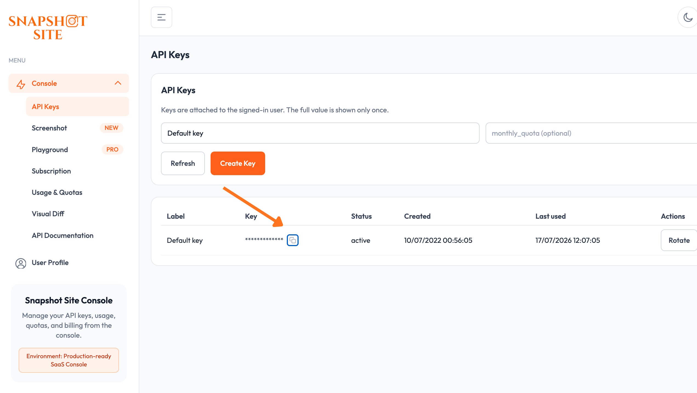
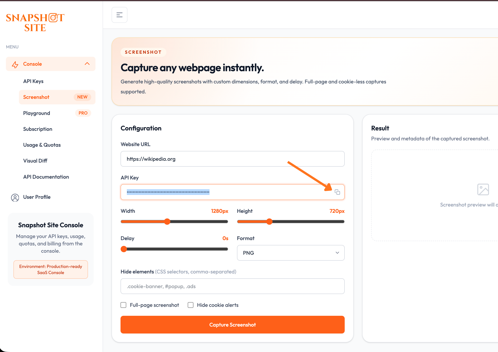

# Snapshot Site MCP

[](https://www.npmjs.com/package/@snapshot-site/mcp)
[](https://nodejs.org/)
[](https://github.com/snapshot-site/snapshot-site-mcp/blob/main/LICENSE)
[](https://github.com/snapshot-site/snapshot-site-mcp/actions/workflows/tests.yml)

Official MCP server for the Snapshot Site API

## Tools

- `screenshot`
- `analyze`
- `compare`

These tools are annotated for MCP clients as:

- read-only
- idempotent
- open-world

They also include richer titles, category metadata, and example intents to improve tool selection in Claude Desktop and Cursor.

## Two ways to connect

**Hosted, with OAuth** — point your client at `https://mcp.snapshot-site.com/mcp`
and sign in. There is no local process to run and no API key in your client
config; the server resolves your account from the OAuth session.

**Local, with an API key** — run the package yourself over stdio and provide
`SNAPSHOT_SITE_API_KEY`. The server calls the Snapshot Site API directly.

Either way, calls count against the same plan quota as direct API calls. Nothing
is metered differently because it came through MCP.

## Credentials

The hosted server needs no credential — you sign in through OAuth and the server
resolves your account from the session. Skip this section unless you run the
server yourself over stdio.

For local stdio mode you need a Snapshot Site API key.

1. Sign up for a [Snapshot Site Console](https://console.snapshot-site.com/) account.
2. Create an API key on the [API Keys](https://console.snapshot-site.com/api-keys) page.

   
3. Pass the key to the server as the `SNAPSHOT_SITE_API_KEY` environment variable.
4. Leave `SNAPSHOT_SITE_BASE_URL` at its default (`https://api.prod.ss.snapshot-site.com`)
   unless you're pointed at a self-hosted or staging instance.

## Compatibility

Requires Node.js 20.9 or later. Built against `@modelcontextprotocol/sdk` v1.28
and tested with Claude Desktop and Cursor over stdio, and with any client that
speaks the streamable HTTP transport against the hosted endpoint.

## Usage

Not sure which options to use? Preview a capture and its parameters in the
[Screenshot](https://console.snapshot-site.com/screenshot) console playground
before wiring them into a tool call.



## OAuth discovery flow

What a client does when connecting to the hosted server:

```text
1. Discovery

Claude
  -> GET https://mcp.snapshot-site.com/.well-known/oauth-protected-resource

MCP
  -> responds:
     authorization_servers = https://mcp.snapshot-site.com
```

```text
2. Authorization

Claude
  -> must know client_id
  -> opens:
     https://mcp.snapshot-site.com/oauth/v2/authorize
     ?client_id=...
     &redirect_uri=https://claude.ai/api/mcp/auth_callback
     &response_type=code
     &code_challenge=...
```

```text
3. Token

Claude
  -> receives an access token
  -> calls the MCP server:
     POST https://mcp.snapshot-site.com/
     Authorization: Bearer <access_token>
```

The server then validates the token against the issuer and resolves the account
it belongs to before running the tool.

### Verifying the deployment

```bash
curl -s https://mcp.snapshot-site.com/.well-known/oauth-protected-resource | jq
curl -s https://mcp.snapshot-site.com/.well-known/openid-configuration | jq
curl -i https://mcp.snapshot-site.com/
curl -i -X POST https://mcp.snapshot-site.com/mcp -H 'content-type: application/json' --data '{}'
```

### Manual vs implicit client_id

- The `client_id` is only needed for the authorization step.
- If your client cannot discover that `client_id` beforehand, enter it manually in the connector UI.
- It cannot be injected later once the OAuth flow has started.
- The server can publish an experimental implicit mode by exposing a `preferred_client_id` in `/.well-known/oauth-protected-resource`.
- Clients that read this metadata may then skip the manual entry. Clients that ignore the field still require a manual `client_id`.

## Environment

```bash
export SNAPSHOT_SITE_API_KEY=ss_live_xxx
export SNAPSHOT_SITE_BASE_URL=https://api.prod.ss.snapshot-site.com
```

## Build

```bash
pnpm install
pnpm run build
```

## Local stdio mode

```bash
export SNAPSHOT_SITE_API_KEY=ss_live_xxx
snapshot-site-mcp
```

## Claude Desktop configuration

```json
{
  "mcpServers": {
    "snapshot-site": {
      "command": "node",
      "args": ["/absolute/path/to/snapshot-site-mcp/build/server.js"],
      "env": {
        "SNAPSHOT_SITE_API_KEY": "ss_live_xxx",
        "SNAPSHOT_SITE_BASE_URL": "https://api.prod.ss.snapshot-site.com"
      }
    }
  }
}
```

## Cursor configuration

```json
{
  "mcpServers": {
    "snapshot-site": {
      "command": "node",
      "args": ["/absolute/path/to/snapshot-site-mcp/build/server.js"],
      "env": {
        "SNAPSHOT_SITE_API_KEY": "ss_live_xxx"
      }
    }
  }
}
```

## Remote HTTP mode

This package also supports a hosted MCP endpoint for clients using `mcp-remote`.

Start the HTTP server:

```bash
pnpm start:http
```

or:

```bash
npx snapshot-site-mcp-http
```

Environment variables:

```bash
export PORT=3000
export HOST=0.0.0.0
export MCP_PATH=/mcp
export HEALTH_PATH=/healthz
export MCP_ALLOWED_HOSTS=mcp.snapshot-site.com
export SNAPSHOT_SITE_BASE_URL=https://api.prod.ss.snapshot-site.com
```

Remote client configuration with direct API key header:

```json
{
  "mcpServers": {
    "Snapshot Site MCP": {
      "command": "npx",
      "args": [
        "mcp-remote",
        "https://mcp.snapshot-site.com/mcp",
        "--header",
        "x-snapshotsiteapi-key: ss_live_xxx"
      ]
    }
  }
}
```

The hosted server is stateless. Each request authenticates with `x-snapshotsiteapi-key`, which makes the service safe to run on multiple replicas without session affinity.

## Zitadel / OAuth

The remote HTTP server also supports OAuth bearer tokens validated against an OIDC issuer such as Zitadel.

Environment variables:

```bash
export OIDC_ISSUER_URL=https://auth.snapshot-site.com
export OIDC_AUDIENCE=snapshot-site-mcp
export OIDC_REQUIRED_SCOPE=claudeai
export OIDC_DISCOVERY_CLIENT_ID=366546620977775166
export RESOURCE_SERVER_URL=https://mcp.snapshot-site.com
export ALLOW_API_KEY_AUTH=false
export SNAPSHOT_SITE_API_KEY=ss_server_side_xxx
```

In bearer-token mode, the MCP server validates the incoming access token against the issuer JWKS and then uses the server-side Snapshot Site API key to call the backend API.

It also exposes and proxies:

```text
GET /.well-known/oauth-protected-resource
GET /.well-known/openid-configuration
GET/POST /oauth/v2/*
GET /ui/*
GET/POST /oauth/register
```

so MCP clients can discover the authorization server metadata automatically.

When `OIDC_DISCOVERY_CLIENT_ID` is set, the protected resource metadata also includes:

```json
{
  "resource_name": "Snapshot Site MCP",
  "preferred_client_id": "366546620977775166",
  "oauth_client_metadata": {
    "client_id": "366546620977775166",
    "token_endpoint_auth_method": "none"
  }
}
```

This is an experimental compatibility hint for clients that can infer the OAuth public client automatically. Manual `client_id` entry remains the reliable fallback.

The MCP server also exposes a lightweight `registration_endpoint` compatibility shim at:

```text
POST https://mcp.snapshot-site.com/oauth/register
```

This shim currently returns the preconfigured public PKCE client instead of provisioning a brand-new Zitadel client per installation. It validates and reflects the `redirect_uris` requested by the client, as long as they are valid HTTPS URLs. It is meant to improve compatibility with clients that expect DCR-style discovery, while keeping the existing manual flow as fallback.
